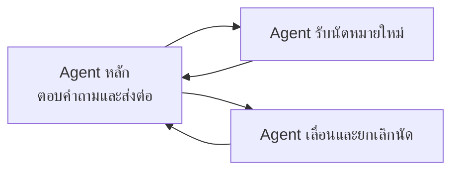

# ออกแบบทีมหลาย AI Agent

> แนวทางแบ่งงาน ส่งต่อสาย เขียน Prompt ทดสอบ และเปิดใช้งานทีมที่มี AI Agent หลายตัวคุยต่อกันในสายเดียว ให้พร้อมใช้งานจริง
>
> Source: https://docs.ingfah.ai/guides/inbound-outbound/multi-agent-team/

[ทีม AI Agent](/guides/inbound-outbound/create-ai-agent-team/) หนึ่งทีมมี AI Agent ได้หลายตัว และส่งต่อสายกันได้ภายในการโทรครั้งเดียว หน้านี้รวมแนวทางออกแบบ สร้าง ทดสอบ และเปิดใช้งานทีมหลาย Agent ให้ทำงานได้ดีกับสายจริง

แนวทางทั้งหมดมาจากทีมสายด่วนรับแจ้งเคลมที่ใช้งานจริง ซึ่งแบ่ง AI Agent ตัวเดียวออกเป็น 4 ตัว คือ Agent หลักที่ตอบคำถามและส่งต่อ Agent รับแจ้งเคลมในสาย 2 ตัว และ Agent ที่แนะนำช่องทางสำหรับเคลมที่รับแจ้งทางโทรศัพท์ไม่ได้

---

## เมื่อไหร่ควรแบ่งเป็นหลาย Agent

แบ่งเมื่อแต่ละช่วงของสายต้องใช้ **Tool ต่างกัน สิ่งแรกที่ทำต่างกัน หรือมีข้อห้ามที่ขัดกัน** เช่น

- Agent ตอบคำถามที่ห้ามเก็บข้อมูลส่วนตัว กับ Agent รับแจ้งที่ต้องเก็บเลขบัตรประชาชนก่อนอย่างอื่น
- ช่วงที่ห้ามทำบางอย่างโดยเด็ดขาด ไม่ใช่แค่ไม่แนะนำ ตัวอย่างจริง เคลมประเภทหนึ่งรับแจ้งได้เฉพาะออนไลน์ แต่ Agent ที่มี Tool รับแจ้งอยู่ก็ยังรับแจ้งในสายต่อ ไม่ว่าจะเขียน Prompt ห้ามอย่างไร ปัญหาหายไปเมื่อส่งเคลมประเภทนี้ให้ Agent ที่**ไม่มี Tool รับแจ้งเลย**

:::tip
ให้ Agent แต่ละตัวมีเฉพาะ Tool ที่หน้าที่ของตัวเองต้องใช้ Agent ที่ไม่มี Tool จะทำสิ่งที่ไม่ควรทำไม่ได้
:::

ไม่ควรแบ่งเพื่อแยกเงื่อนไขเล็ก ๆ ที่เขียนใน Prompt ไม่กี่บรรทัดก็พอ เพราะทุก Agent ต้องมีกฎพื้นฐานซ้ำกัน การส่งต่อแต่ละครั้งเพิ่มเวลาตอบเล็กน้อย และทุกเส้นทางส่งต่อคืออีกเส้นทางที่ต้องทดสอบ

---

## ทีมหลาย Agent ทำงานอย่างไร

- **เส้นทางส่งต่อมีทิศทางเดียว** การเชื่อม Agent A ไป Agent B ในหน้าทีม ทำให้ A ส่งต่อให้ B ได้ แต่ B ส่งกลับไม่ได้ ถ้าต้องการให้ส่งกลับ ต้องเพิ่มเส้นทางจาก B ไป A อีกเส้น
- **Tool ส่งต่อถูกสร้างให้อัตโนมัติจากเส้นทาง** ไม่ต้องเพิ่มใน Tools ของ Agent ชื่อ Tool คือ `transfer_to_` ตามด้วยรหัส (slug) ของ Agent ปลายทาง โดยเปลี่ยนขีด `-` เป็นขีดล่าง `_` เช่น Agent ปลายทางรหัส `clinic-booking` จะได้ Tool ชื่อ `transfer_to_clinic_booking` ให้เขียนชื่อนี้ใน Prompt ให้ตรงทุกตัวอักษร
- **แต่ละเส้นทางควรมีคำอธิบายการส่งต่อ** บอกว่าใช้เมื่อไหร่ และเป็นการส่งต่อแบบเงียบหรือไม่ ถ้าไม่มีคำอธิบาย Agent จะส่งต่อเฉพาะเมื่อลูกค้าขอคุยกับ Agent ปลายทางเอง ซึ่งแทบไม่เกิดขึ้น
- **Agent ทุกตัวในเส้นทางต้องเผยแพร่แล้ว** และเป็นประเภทเดียวกับทีม (เสียงหรือข้อความ)
- **Tool ของแต่ละ Agent ไม่ถูกส่งต่อตามสาย** Agent ทุกตัวที่ต้องวางสาย โอนสายหาเจ้าหน้าที่ หรือค้นคลังความรู้ ต้องเปิด Tool นั้นไว้เอง Agent ที่ไม่มี Tool วางสายจะวางสายเองไม่ได้ แม้จะกล่าวลาแล้ว
- **ตัวแปรเวลาใช้เวลาเริ่มสาย** เช่น `{{hour}}` และ `{{dayOfWeek}}` ไม่เปลี่ยนหลังส่งต่อ ถ้ามีเงื่อนไขเวลาทำการ ต้องใส่ไว้ใน Prompt ของ Agent ทุกตัว

### รูปแบบการส่งต่อ

| | แบบปกติ | แบบไร้รอยต่อ (Seamless) |
|---|---|---|
| Agent ที่ส่งต่อ | กล่าวลาก่อนส่งต่อ | ไม่พูดอะไร |
| Agent ที่รับต่อ | ไม่เห็นบทสนทนาก่อนหน้า | เห็นบทสนทนาทั้งหมด |
| ประโยคแรกของ Agent ที่รับต่อ | ข้อความทักทายของตัวเอง | คำตอบที่ต่อจากบทสนทนา ไม่พูดข้อความทักทาย |
| ลูกค้ารู้สึกว่า | มีคนใหม่มารับสาย | คุยกับ Agent ตัวเดียวตลอดสาย |

:::note[การเปิดใช้งานแบบไร้รอยต่อ]
ทีมที่สร้างใหม่ใช้การส่งต่อแบบปกติ หากต้องการแบบไร้รอยต่อ ให้ติดต่อทีมงานอิงฟ้า หากไม่แน่ใจว่าทีมใช้แบบใด ให้ทดลองโทรจนเกิดการส่งต่อ ถ้า Agent แรกกล่าวลาและ Agent ที่รับต่อทักทายใหม่ แปลว่าเป็นแบบปกติ
:::

เขียน Agent ให้ตรงกับรูปแบบที่ทีมใช้

- **แบบไร้รอยต่อ** (แนะนำเมื่อใช้ตัวตนเดียวทั้งทีม) ข้อความทักทายของ Agent ที่รับต่อจะไม่ถูกพูด และในเทิร์นแรก Agent ที่รับต่อจะส่งสายกลับทันทีไม่ได้ แต่ใช้ Tool อื่นของตัวเองได้ เทิร์นแรกจึงเป็นการเรียก Tool ได้เลย
- **แบบปกติ** Agent ที่รับต่อต้องถามข้อมูลที่ต้องใช้ใหม่ และข้อความทักทายคือสิ่งแรกที่ลูกค้าได้ยิน จึงควรเขียนเป็นขั้นตอนถัดไป เช่น "ขอทราบชื่อและนามสกุลของผู้ที่จะมารับบริการค่ะ" ไม่ใช่การแนะนำตัวใหม่

---

## ออกแบบทีม

**ใช้โครงแบบดาว** Agent หลักหนึ่งตัวรับสายและส่งต่อ Agent เฉพาะทางแต่ละตัวส่งกลับมาที่ Agent หลักเมื่อเรื่องอยู่นอกหน้าที่ ไม่ส่งต่อกันเอง เพราะทุกเส้นทางที่เพิ่มคือโอกาสส่งผิด



**กำหนดให้ชัดว่าใครถามอะไร** Agent หลักถามเฉพาะคำถามที่ใช้ตัดสินว่าจะส่งต่อให้ใคร แล้วส่งต่อ Agent เฉพาะทางห้ามถามคำถามเหล่านั้นซ้ำ ในสายจริงเกิดทั้งสองแบบ คือ Agent หลักเก็บข้อมูลรับแจ้งเอง และ Agent เฉพาะทางถามประเภทเคลมซ้ำ

**เขียนขั้นตอนส่งต่อเป็นลำดับ** เช่น "ขั้นที่ 1 ดูประวัติว่าผู้โทรตอบแล้วหรือยังว่าเป็นเจ้าของบ้านหรือแจ้งแทน ถ้ายังไม่ตอบ เทิร์นนี้ถามข้อนี้ข้อเดียว ห้ามเรียก Tool ส่งต่อ ขั้นที่ 2 เมื่อได้คำตอบแล้ว เทิร์นถัดไปคือการเรียก Tool ส่งต่ออย่างเดียว" การเขียนสั้น ๆ ว่า "ถาม X แล้วส่งต่อ" ทำให้ Agent ข้าม X เมื่อลูกค้าแจ้งความต้องการมาตั้งแต่แรก

**วางทางกลับของ Agent เฉพาะทางแต่ละตัว**

- ลูกค้าเปลี่ยนใจ หรือต้องการเรื่องอื่น ส่งกลับ Agent หลักแบบเงียบ
- ลูกค้าถามคำถามระหว่างทำงาน ตอบสั้น ๆ หรือบอกว่าจะตอบให้หลังทำเสร็จ แล้วถามข้อที่ค้างต่อ
- ลูกค้าถามคำถามหลังทำงานเสร็จ ให้ Agent นั้นตอบเอง โดยเปิด Tool ค้นคลังความรู้ไว้ด้วย ในสายจริง Agent ที่ไม่มี Tool นี้ตอบลูกค้าว่า "ไม่มีข้อมูล" หลังรับแจ้งเสร็จ
- ลูกค้าต้องการเริ่มเรื่องใหม่ ส่งกลับ Agent หลัก

**ให้ทุก Agent มีปลายทางที่ลูกค้าอาจต้องการ** ถ้าลูกค้าอาจขอคุยกับเจ้าหน้าที่ระหว่างคุยกับ Agent ตัวไหน Agent ตัวนั้นต้องมี Tool โอนสายหาเจ้าหน้าที่ เงื่อนไขเวลาทำการ และกฎการโอนสายเดียวกัน ลำดับของ Tool ก็มีผลต่อการเลือก ในกรณีหนึ่ง การย้าย Tool ที่ควรเป็นค่าตั้งต้นขึ้นก่อนแก้ปัญหาส่งผิดได้ ในขณะที่ตัวอย่างผิด/ถูกแก้ไม่ได้

**ตั้งคำอธิบาย Agent ให้คนในทีมแยกออก** บอกชื่อทีม หน้าที่ สิ่งแรกที่ทำ และส่งต่อไปที่ใด ส่วนชื่อเรียก Agent (vocal name) คือชื่อที่ Tool ส่งต่อใช้อธิบาย Agent ปลายทาง

---

## เขียน Prompt ของแต่ละ Agent

**คัดลอกกฎพื้นฐานไปทุก Agent** เช่น ตัวตนและคำลงท้าย การไม่พูดซ้ำ ขั้นตอนเมื่อฟังไม่ชัด รูปแบบการพูด ข้อห้าม การบอกว่าเป็น AI และการวางสาย ในทีมหนึ่ง Agent เฉพาะทางขาดกฎการไม่พูดซ้ำและขั้นตอนเมื่อฟังไม่ชัด และเป็นต้นเหตุของปัญหาครึ่งหนึ่งที่พบหลังเปิดใช้งาน ให้กฎส่วนนี้เหมือนกันทุกตัวอักษร และแก้พร้อมกันทุก Agent

**ใช้ตัวตนเดียวกัน** ในทีมแบบไร้รอยต่อ ลูกค้าได้ยิน Agent ตัวเดียว ทุก Agent ต้องใช้ชื่อ เสียง และคำลงท้ายเดียวกัน แนะนำให้ใช้[ตัวแปร](/guides/ai-agent/flow-variables/)สำหรับคำลงท้าย เพื่อให้เปลี่ยนเพศของ Agent ได้ในที่เดียว และอย่าลืมประโยคที่ Tool พูดเอง เช่น ประโยคขอให้กดเลขบัตร หรือประโยครอสายของการโอนหาเจ้าหน้าที่ ซึ่งไม่ได้อยู่ใน Prompt

**ใส่ส่วน "การเข้ารับสายต่อ" ไว้บนสุดของคำสั่งงาน ในทุก Agent ที่รับสายต่อ** ถ้าไม่มี Agent จะเข้าใจว่าการส่งต่อในประวัติเป็นการโอนสายของตัวเอง แล้วขอโทษ บอกว่ากำลังโอนสาย หรือเลี่ยงไม่ทำงาน ตัวอย่างจากทีมที่ใช้งานจริง (แบบไร้รอยต่อ):

```
## การเข้ารับสายต่อ (อ่านก่อนทุกส่วน)

คุณเข้าสู่สายที่ระบบส่งต่อมาแบบไร้รอยต่อ ในมุมมองของผู้โทร คุณคือ {{agentName}} คนเดิมที่คุยอยู่ด้วยตลอดสาย
- ห้ามแนะนำตัวใหม่ ห้ามทักทายใหม่ ห้ามบอกว่ามีการเปลี่ยนผู้ช่วยหรือมีการส่งต่อ
- การส่งต่อที่นำคุณเข้ามาสำเร็จเสมอ ผลของเครื่องมือ transfer_to_... ในประวัติคือการที่คุณเข้ามารับสาย ไม่ใช่การโอนสายของคุณ
- เทิร์นแรกของคุณห้ามบอกว่าทำไม่ได้ ห้ามเสนอโอนสายหาเจ้าหน้าที่ และห้ามเรียกเครื่องมือส่งต่อกลับ
- ผู้โทรตอบ <คำถามที่ Agent หลักถามแล้ว> แล้ว ห้ามถามซ้ำ
- เทิร์นแรกหลังเข้าสายคือการเรียก <Tool แรก> อย่างเดียว ข้อความพูดว่างเปล่า
```

**เขียนเทิร์นส่งต่อเป็นการเรียก Tool อย่างเดียว และอธิบายแทนการเขียนประโยค** ตัวอย่างที่ถูกของการส่งต่อคือ "เทิร์นนี้มีแค่การเรียกเครื่องมือ transfer_to_... ข้อความพูดว่างเปล่า" ในการทดสอบ ตัวอย่างที่ใส่วงเล็บ เช่น `[เรียก transfer_to_human_agent]` ถูกพูดออกมาเป็นข้อความ 4 ครั้ง ส่วนตัวอย่างที่ผิด ให้อธิบายความผิด เช่น "โอนสายทันทีโดยยังไม่รู้ว่าลูกค้าต้องการอะไร" แทนการยกประโยค เพราะ Agent มักพูดตามประโยคที่ยกมา

**บอกขอบเขตของ Agent เฉพาะทางแต่ละตัว** ว่าทำอะไร ส่งกลับเมื่อไหร่ และห้ามทำอะไร

**ใส่ "ข้ามสิ่งที่ลูกค้าบอกแล้ว" ไว้ในแต่ละขั้นตอนการเก็บข้อมูล** ไม่ใช่แยกไว้ในหัวข้อกฎ

**ตรวจข้อมูลก่อนจบงาน** ก่อนขั้นตอนที่ปิดงาน เช่น ขอความยินยอม ทวนข้อมูล หรือกล่าวลา ให้ Agent ตรวจว่ามีข้อมูลครบตามที่ระบบปลายทางต้องใช้ ถ้าขาดข้อไหนให้ถามข้อนั้นก่อน ในสายจริงมีเคลมที่เข้า CRM โดยไม่มีชื่อผู้ประสบภัย เพราะเงื่อนไขหนึ่งข้ามไปขอความยินยอมเลย การตรวจที่ขั้นตอนนั้นแก้ได้ ในขณะที่การแก้ถ้อยคำของคำถามก่อนหน้าแก้ไม่ได้

ดูหลักการเขียน Prompt ทั่วไปเพิ่มเติมที่ [เทคนิคการเขียน Prompt](/guides/ai-agent/prompting-tips/)

---

## สร้างทีมทีละขั้น

1. **สร้างและเผยแพร่ Agent ทุกตัว** พร้อมเปิด Tool ที่แต่ละตัวต้องใช้ (ดู [การจัดการ AI Agent](/guides/ai-agent/manage-ai-agent/))
2. **สร้างทีมและเชื่อมเส้นทางส่งต่อ** ทั้งขาไปและขากลับ ตาม[สร้างทีม AI Agent](/guides/inbound-outbound/create-ai-agent-team/)
3. **แจ้งทีมงานอิงฟ้า** หากต้องการการส่งต่อแบบไร้รอยต่อ หรือต้องการ Tool การโทรใหม่ เช่น Tool รับเลขจากแป้นโทรศัพท์ หรือ Tool โอนสายหาเจ้าหน้าที่ที่มีประโยครอสายหรือเบอร์ปลายทางของตัวเอง
4. **ตั้งผลลัพธ์หลังวางสาย** ตาม[ผลลัพธ์หลังจบการสนทนา](/guides/inbound-outbound/call-outcome-setup/)
5. **ทดสอบ** ตามหัวข้อถัดไป แล้วจึงผูกเบอร์โทรศัพท์กับทีม ตาม[ตั้งค่า AI Agent ให้รับสายโทรเข้า](/guides/inbound-outbound/inbound-set-up/)

:::tip[สร้างทีมด้วย Ingfah Skill]
[Ingfah Skill](/guides/ingfah-skill/overview/) สร้าง Agent ทุกตัว เชื่อมเส้นทางส่งต่อพร้อมคำอธิบาย ตั้งผลลัพธ์หลังวางสาย และตรวจผลที่บันทึกจริงให้ได้ผ่าน API Key ตัวอย่างการสั่งงาน

"ช่วยสร้างทีมหลาย Agent สำหรับคลินิกทันตกรรม มี Agent หลักตอบคำถามและส่งต่อ Agent รับนัดหมายใหม่ และ Agent เลื่อนหรือยกเลิกนัด ใช้เสียงผู้หญิงชื่อน้องยิ้มทุกตัว"

AI จะแสดงรายละเอียดทั้งหมดให้ตรวจก่อนสร้างทุกครั้ง ส่วนการเปิดแบบไร้รอยต่อและการสร้าง Tool การโทรใหม่ยังต้องติดต่อทีมงานอิงฟ้า
:::

---

## ทดสอบก่อนเปิดใช้งาน

ทดสอบ Agent ทุกตัวแยกกัน และทุกเส้นทางส่งต่อ

- **Agent หลัก** ส่งต่อถูกที่ในแต่ละเรื่อง ไม่ถามข้อมูลที่ Agent เฉพาะทางจะถาม ถามคำถามตัดสินเมื่อยังไม่รู้ และไม่ถามเมื่อลูกค้าบอกแล้ว รวมถึงกรณีใกล้เคียงที่**ไม่ควร**ส่งไปเส้นทางนั้น
- **Agent เฉพาะทาง** เทิร์นแรกหลังรับสายต่อไม่ทักทายหรือแนะนำตัวใหม่ ไม่ถามซ้ำ ทำขั้นตอนแรกทันที ส่งกลับเมื่อลูกค้าเปลี่ยนเรื่อง และถามข้อมูลที่ขาดก่อนปิดงาน
- **ทุก Agent** ไม่พูดชื่อ Tool และวางสายได้เองเมื่อจบสาย

การ[ทดลองคุย](/guides/ai-agent/try-call/)เปิดจาก Agent ทีละตัว ให้ดูในบทสนทนาว่ามีการเรียก Tool `transfer_to_...` หรือไม่ Agent ที่บอกว่ากำลังส่งต่อแต่ไม่มีการเรียก Tool แปลว่าไม่ได้ส่งต่อจริง ก่อนเปิดเบอร์ให้ลูกค้าโทร ให้โทรเข้าทีมจริงให้ผ่านทุกเส้นทางส่งต่ออย่างน้อยหนึ่งครั้ง และทดลองแต่ละกรณีซ้ำ 2-3 ครั้ง เพราะ Agent ตอบไม่เหมือนกันทุกครั้ง

สำหรับทีมที่แก้ไขบ่อย แนะนำ[ชุดทดสอบอัตโนมัติ](/guides/ingfah-skill/automated-testing/) โดยตั้งชุดทดสอบแยกต่อ Agent และหลังแก้ Agent ตัวใด ให้รันชุดทดสอบของทุก Agent เพราะการแก้ที่ช่วย Agent ตัวหนึ่งอาจทำให้อีกตัวแย่ลง

---

## รายการตรวจก่อนเปิดใช้งาน

- [ ] Agent ทุกตัวเผยแพร่แล้ว และเปิด Tool ครบ รวมถึง Tool วางสายในทุก Agent ที่จบสายได้
- [ ] มีเส้นทางส่งต่อครบทั้งขาไปและขากลับ และทุกเส้นทางมีคำอธิบายการส่งต่อ
- [ ] ชื่อ `transfer_to_...` ใน Prompt ตรงกับรหัสของ Agent ปลายทาง
- [ ] ทราบรูปแบบการส่งต่อของทีม และเขียน Agent ที่รับต่อให้ตรงกับรูปแบบนั้น
- [ ] กฎพื้นฐานเหมือนกันทุก Agent และใช้ตัวตนเดียวกันทั้งใน Prompt เสียง และประโยคของ Tool
- [ ] ทุก Agent มีเงื่อนไขเวลาทำการ (ถ้ามี)
- [ ] ทดสอบผ่านซ้ำหลายรอบ และโทรจริงผ่านทุกเส้นทางส่งต่อแล้ว

---

## ช่วงแรกหลังเปิดใช้งาน

อ่านสายจริงทุกวันในช่วงแรก โดยดูจาก[สายทั้งหมด](/guides/inbound-outbound/all-calls/) แล้วตรวจคำถามต่อไปนี้

- มีการส่งต่อเมื่อควรส่ง และเฉพาะเมื่อควรส่งหรือไม่
- Agent หลักถามข้อมูลแทน Agent เฉพาะทาง หรือ Agent เฉพาะทางถามซ้ำหรือไม่
- มี Agent พูดชื่อ Tool ตัวยึดตำแหน่ง หรือคำค้นหาออกมาหรือไม่
- ข้อมูลครบพอสำหรับระบบปลายทางหรือไม่
- สายจบถูกต้องไม่ว่าลูกค้าจะคุยอยู่กับ Agent ตัวไหน

ทุกปัญหาที่พบ ให้เพิ่มเป็นกรณีทดสอบก่อนแก้ แล้วแก้ทีละเรื่อง สิ่งที่ทีมสายด่วนพบในสองวันแรก และวิธีที่แก้ได้จริง:

| ปัญหาที่พบ | วิธีแก้ที่ได้ผล |
|---|---|
| Agent เฉพาะทางบอกว่าภัยที่คุ้มครองไม่อยู่ในความคุ้มครอง หลังถามซ้ำแล้วได้ยินคำตอบไม่ชัด | ไม่ถามซ้ำเรื่องที่ลูกค้าบอกแล้ว คำตอบที่ฟังไม่ออกถือว่าไม่ชัด ไม่ใช่คำตอบปฏิเสธ และวางตัวอย่างผิด/ถูกไว้ข้างคำถามนั้น |
| Agent พูดประโยคเปิดก่อน แล้วพูดคำค้นคลังความรู้ออกมาเป็นข้อความ | เขียนเป็นลำดับ ค้นก่อนแล้วจึงพูด ในเทิร์นเดียวกัน |
| ได้ยินไม่ชัดหนึ่งเทิร์นแล้ว Agent ข้ามคำถามชื่อ | จำกัดการถามซ้ำไว้ที่คำถามของตัวเอง และกำหนดคำถามถัดไปหลังการทวนให้ชัด |
| ผู้แจ้งแทนกดเลขบัตรของตัวเองเป็นเลขบัตรของผู้ประสบภัย | เทียบเลขบัตรและชื่อทั้งสองคนก่อนขอความยินยอม และถามหนึ่งครั้งว่าบัตรแรกเป็นของใคร |
| Agent เฉพาะทางตอบว่าไม่มีข้อมูลหลังรับแจ้งเสร็จ | เปิด Tool ค้นคลังความรู้ให้ใช้หลังทำงานเสร็จ และส่งกลับเฉพาะเมื่อเริ่มเรื่องใหม่ |
| แนะนำช่องทางออนไลน์ซ้ำหลังลูกค้าเลือกแจ้งในสายแล้ว | แนะนำได้ครั้งเดียวต่อสาย ในจุดเดียว ทั้งทีม |
